# Project Overview

## Giới thiệu
Dự án này là một ứng dụng web được xây dựng bằng Spring Boot, sử dụng Thymeleaf cho phần giao diện và Cloudinary để quản lý tệp tin. Ứng dụng cho phép người dùng đăng ký,tìm kiếm công việc, tạo công ty, và đăng tin tuyển dụng.

## Tính năng
- **Đăng ký người dùng**: Người dùng có thể đăng ký với vai trò là ứng viên hoặc công ty.
- **Tạo công ty**: Người dùng có thể tạo một công ty mới và tải lên logo cho công ty.
- **Đăng tin tuyển dụng**: Công ty có thể tạo và quản lý các tin tuyển dụng, bao gồm việc thêm các kỹ năng yêu cầu.
- **Quản lý tệp tin**: Ứng dụng sử dụng Cloudinary để tải lên và lưu trữ các tệp tin như logo công ty.
- **Tìm kiếm tin tuyển dụng**: Ứng viên có thể tìm kiếm các tin tuyển dụng theo từ khóa hoặc tiêu chí yêu cầu.

## Công nghệ sử dụng
- **Backend**: 
  - Java
  - Spring Boot
  - Spring Data JPA
  - Cloudinary
- **Frontend**: 
  - Thymeleaf
  - Bootstrap
  - JavaScript
- **Cơ sở dữ liệu**: MariaDB

## Cài đặt
1. Clone repository này về máy của bạn.
2. Cài đặt các phụ thuộc bằng cách chạy lệnh:
   ```bash
   ./gradlew build
   ```
3. Cấu hình thông tin kết nối cơ sở dữ liệu trong file `application.properties`.
4. Chạy ứng dụng bằng lệnh:
   ```bash
   ./gradlew bootRun
   ```

## Sử dụng
- Truy cập vào `http://localhost:8080/registerCandidate` để đăng ký với vai trò ứng viên.
- Truy cập vào `http://localhost:8080/registerCompany` để đăng ký với vai trò công ty.
- Sau khi đăng ký, bạn có thể đăng nhập và tạo công ty hoặc đăng tin tuyển dụng.

## Ghi chú
- Đảm bảo rằng bạn đã cài đặt Java 17 và Gradle trên máy của mình.
- Để sử dụng Cloudinary, bạn cần có tài khoản và cấu hình thông tin API trong ứng dụng.

## Kết quả đạt được
- Trang login
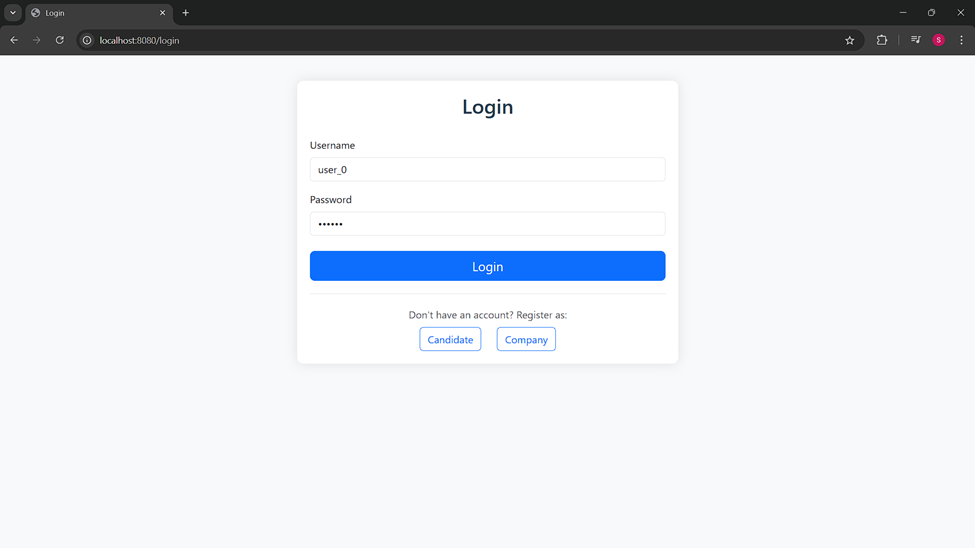
- Chức năng của Candidate
  - Đăng ký
  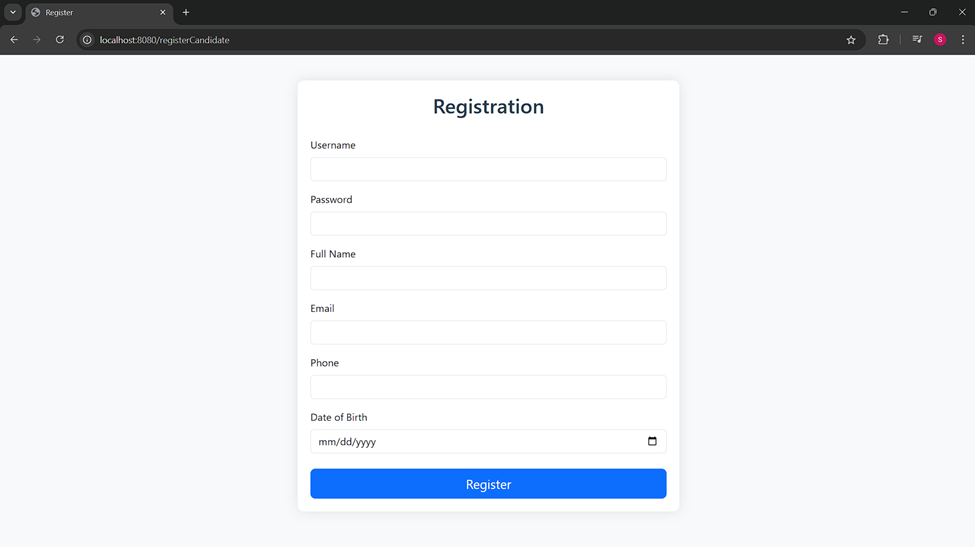
  - Thông tin cá nhân
  
  - Đề xuất công việc
  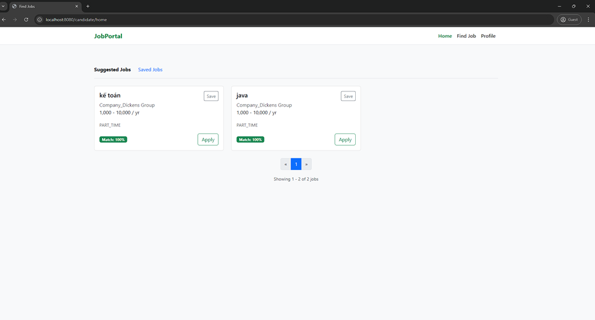
  - Tìm kiếm công việc
  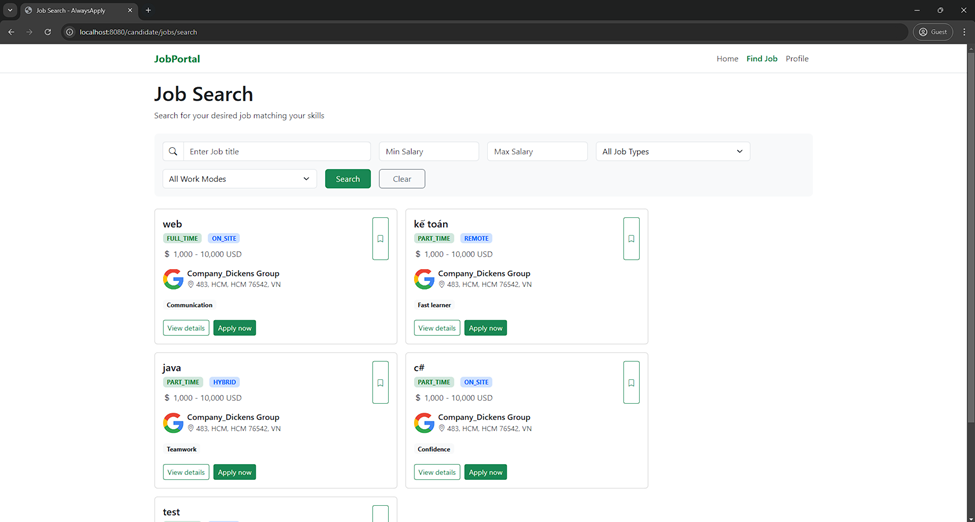
- Chức năng của Company
  - Đăng ký
  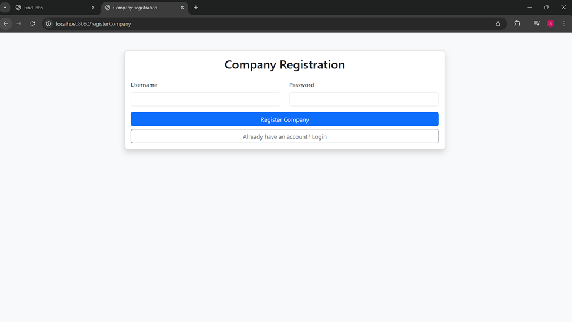
  - Set up công ty
  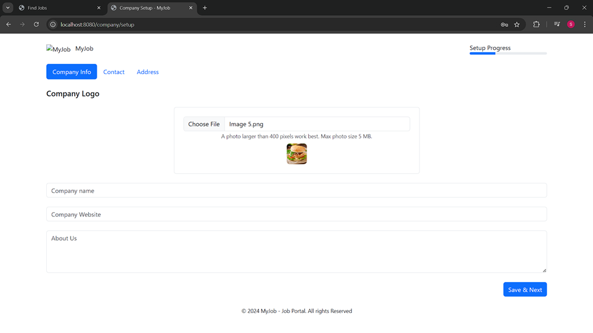
  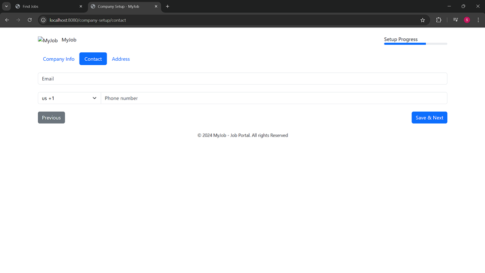
  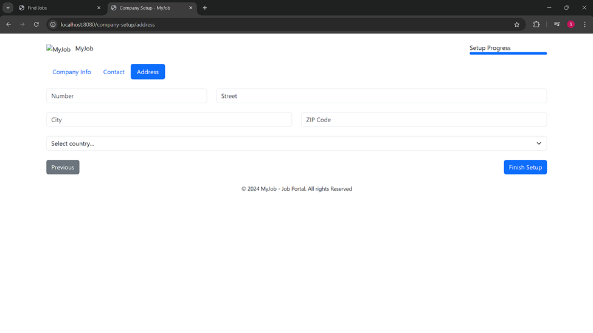
  - Đăng tin tuyển dụng
  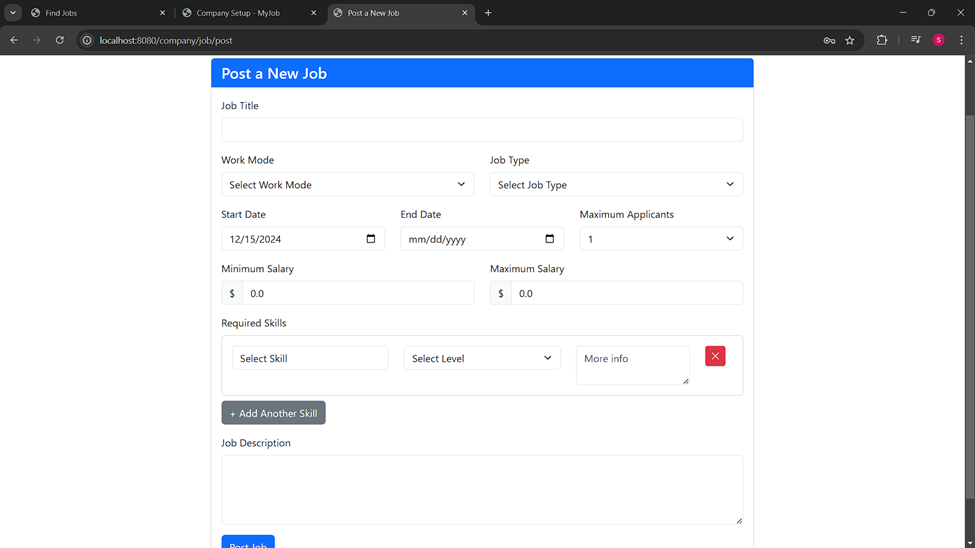
  - Quản lý tin tuyển dụng
  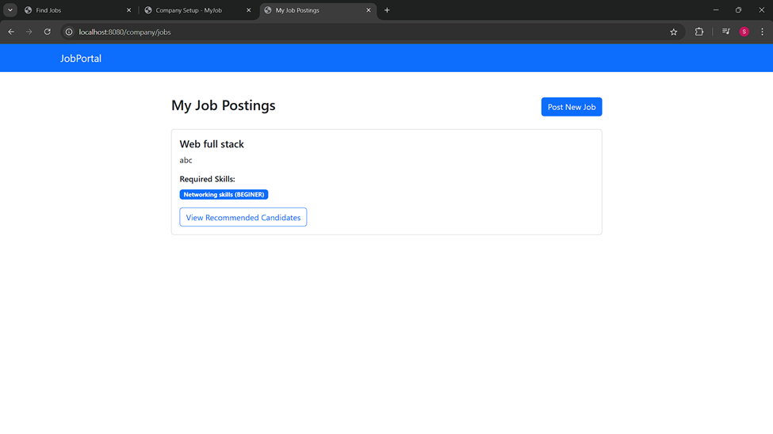
  - Hiện thị ứng viên phù hợp
  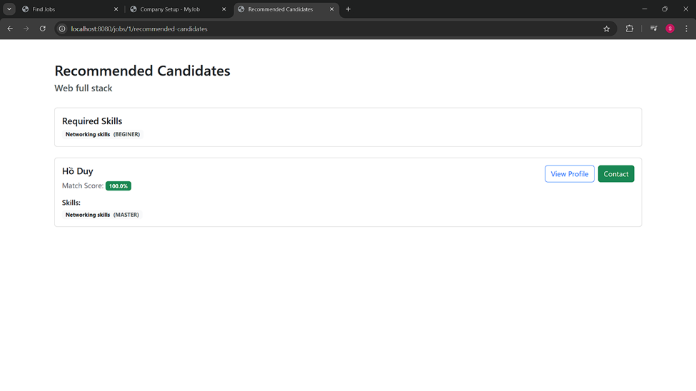
  - Teplate mail thông báo
  

